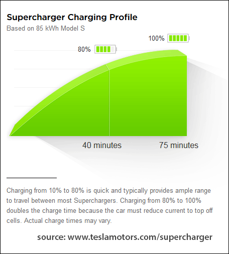

# Hjemmeoppgave

*Matematikk 1 for ingeniørfag (REA1141)*

```yaml
navn: Jonas Johan Solsvik
kull: 16HBPROGA
linje: Programmering [APP|SPILL]
institutt: Datateknologi og Informatikk 
fakultet: Informasjonsteknologi og Elektroteknikk
sted: NTNU Gjøvik    
```


### Lærers oppgavetekst

Tanken med obligen er å anvende matematikk i en praktisk oppgave gjennom bruk av derivasjon, integrasjon og/eller diff.likninger.

Du må selv definere et problem og løse dette.  Ikke fortvil, vi stiller ikke skyhøye krav.

**NB! **  Sy sammen besvarelsen din til ett dokument (helst PDF eller Wordfil) før du laster det opp i Blackboard. 

### Egen oppgavetekst

Jeg har kjøpt meg elbil, og skal på min første 'roadtrip'. Jeg har bestemt meg for å kjøre fra *Lindesnes* til *Nordkapp*. 

**Problem**
Min storebror mener at jeg bør holde høyest mulig hastighet, ha mange korte ladestopp. Han mener at den økte hastigheten vil tjene inn den ekstra tiden som må brukes på mer ladetid pga. økt energiforbruk.
Jeg mener at jeg bør kjøre så effektivt(sakte) som mulig, for å komme lengst mulig på hver lading, og dermed få færrest mulig ladestopp, og stoppe lengst mulig når jeg først stopper.

Hva er den idelle hastigheten? Hva er det ideelle ladeintervallet?

**Datainnsamling**

For å finne ut dette så må det hentes inn litt data.


1. Raskeste veg går igjennom sverige, 2364km[^1], i følge google maps.  Jeg ønsker heller å kjøre en litt lengre veg igjennom Norge, 2533km.[^2] 

$$
D = 2533km
$$


2. Elbilen jeg har kjøpt er en Tesla Model S AWD P100D med 100kwh batteri. [^3] Denne har et forbruk på 21 kWh/100km.[^3]

$$
E = 100kWh  \\
F = 21kWh/100km
$$


3. Et gammelt bilde fra Tesla sin hjemmeside tesla.com[^4] viser ladekapasitet som en funksjon av tid




4. Bruker MyCurveFit[^5] til å numerisk generere en funksjon for ladekapasitet(t) basert verdiene fra bildet over. Outputten fra MyCurveFit:

```
y = 1.421085e-14 + 2.761905x - 0.01904762x^2
```


5. Skriver den om, og fjerner konstantleddet siden det er tilnærmet lik 0.

$$
ladekapasitet \ per \ tid = f(t) = \underline{- 0.019t^{2} + 2.762t}
$$

For å teste at det stemmer så prøver vi å sette inn *t = 75min* . Her forventer vi at *f(t) = 100kWh*.
$$
f(75) = -0.02*75^{2} + 2.76*75  =94.5,  \ \sigma = -5.5 \\
f(75) = -0.019*75^{2} + 2.762*75  = 100.275,  \ \sigma=+0.275 \\
f(75) = -0.0190*75^{2} + 2.7619*75  = 100.2675,  \ \sigma=+0.2675
$$
Vi ser at vi må bruke minst 3 desimaler for å få et utrykk som treffer  < 1kWh fra det vi forventet ideelt sett.


6. Den deriverte av ladekapasitet gir oss ladehastighet:

$$
ladehastighet \ per \ tid = f'(t) = (-0.019t^{2}+2.762t)' = -2*0.019t^{2} + 2.762 = \underline{-0.038t^{2}+2.762}
$$


[^1]: Sweedish-route ,  https://goo.gl/maps/JYmrfFJHUJ42 - 15.11.17
[^2]: Norwegian-route, https://goo.gl/maps/ukhx6uGBVx82 - 15.11.17
[^3]: Tesla energy consumption, https://en.wikipedia.org/wiki/Tesla_Model_S#Energy_consumption - 15.11.17
[^4]: Tesla sin hjemmeside - http://i.imgur.com/cQPkofQ.gif
[^5]: MyCurveFit.com, https://mycurvefit.com/ - 15.11.17


$$
dinstance = d =
$$


