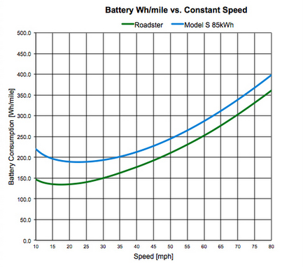
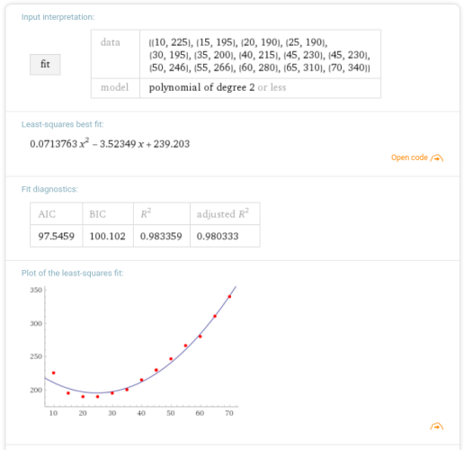
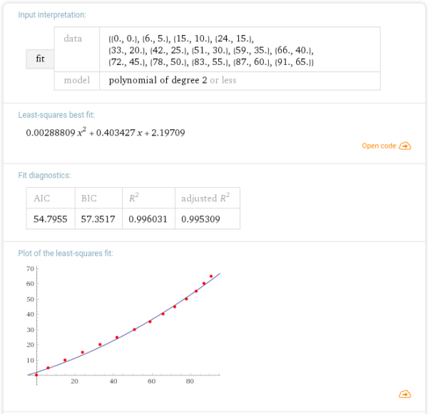

# Hjemmeoppgave

*Matematikk 1 for ingeniørfag (REA1141)*

```yaml
navn: Jonas Johan Solsvik
kull: 16HBPROGA
linje: Programmering [APP|SPILL]
institutt: Datateknologi og Informatikk 
fakultet: Informasjonsteknologi og Elektroteknikk
sted: NTNU Gjøvik    
```

### Oppgave

Tanken med obligen er å anvende matematikk i en praktisk oppgave gjennom bruk av derivasjon, integrasjon og/eller diff.likninger.

Du må selv definere et problem og løse dette.  Ikke fortvil, vi stiller ikke skyhøye krav.

**NB! **  Sy sammen besvarelsen din til ett dokument (helst PDF eller Wordfil) før du laster det opp i Blackboard. 

### Egen oppgavetekst

Jeg har kjøpt meg elbil, og skal på min første 'roadtrip'. Jeg har bestemt meg for å kjøre fra *Lindesnes* til *Nordkapp*. 

**Datainnsamling**

1. **Distanse**
   Raskeste veg går igjennom sverige, 2364km[^1], i følge google maps.  Jeg ønsker heller å kjøre en litt 		lengre veg igjennom Norge, 2533km.[^2] 

$$
D = 2533km
$$


2. **Kapasitet**
   Elbilen jeg har kjøpt er en Tesla Model S AWD P100D med 100kwh batteri. [^3]

$$
Batterikapasitet = 100kWh  \\
$$

3. **Forbruk per hastighet** 

   

   *Image: Tesla.com blog - Model S efficiency and range fra 2012*[^4]

   Grafen ovenfor er hentet fra Tesla sin offisielle blog, hvor det i denne posten fra 2012, diskuteres hvordan fart påvirker rekkevidden.

   **WolframAlpha plot**

   

   ​	**Formel**
   $$
   forbruk(hastighet) = f(v) = 0.0714v^{2} - 3.523v + 239.203 \ (Wh/mile), \\ v=[5,70] 
   $$
   ​


4. **Tid per prosent lading**

   Hvor lang tid tar det å lade fra 60-80 prosent sammenlik med med fra 40-60 prosent. Data for dette har jeg hentet fra en youtube-video[^6] av en Tesla-eier som har tatt tiden på hvor fort bilen sin lader fra 0-90% fulladet (0kWh - 90kWh). 

   **Wolframalpha plot**

   
   ​	**Formel**

$$
Tid(StateOfCharge) = t(soc) = 0.00289soc^{2} + 0.4034soc + 2.197 \ (t_{min}), \\ soc=[0,91]
$$

#### OPPGAVE A)

Jeg starter med fulladet bil. Første etappe til min første ladestopp er 200Km. Hvor mye energi i kWh bruker bilen på den første etappen?

Vi har allerede "forbrukshastighet" fra dataene. Da er det bare å lage et bestemt integral for å få totalforbruket. Vi integrerer med hensyn på kilometer:
$$
Forbruk(km) = \int_{0}^{200} forbruk(hastighet) \ dkm
\\
= \int_{0}^{200} (0.0714v^{2} - 3.523v + 239.203)  \ dkm 
\\
= \bigg(  (0.0714v^{2} - 3.523v + 239.203) \ km \bigg)_0^{200}
\\  
= \underline{ (0.0714v^{2} - 3.523v + 239.203) \times 200 \times (0.6214 mile/km)}
$$
**Python**

```python
def consumption_wh(kph):
	mph = kph / KM_TO_MILE
	return (0.0714*mph**2 - 3.523*mph + 239.203) * MILE_TO_KM

def total_consumption_kwh(kph, km):
	return consumption(kph) * km / 10**3
```

**Output**

```
Kjører 200km i ulike hastigheter:
------------------------------------------------
  km/h    kWh       timer      SOC %
------------------------------------------------
    40 	  24.33 	 5.00 	   75.67
    45 	  24.42 	 4.44 	   75.58
    50 	  24.69 	 4.00 	   75.31
    55 	  25.13 	 3.64 	   74.87
    60 	  25.74 	 3.33 	   74.26
    65 	  26.52 	 3.08 	   73.48
    70 	  27.47 	 2.86 	   72.53
    75 	  28.60 	 2.67 	   71.40
    80 	  29.90 	 2.50 	   70.10
    85 	  31.36 	 2.35 	   68.64
    90 	  33.00 	 2.22 	   67.00
    95 	  34.81 	 2.11 	   65.19
   100 	  36.79 	 2.00 	   63.21
```


#### OPPGAVE B)

Vi har nå fått oversikt over forbruket i ulike hastigheter over 200km.

 

[^1]: Sweedish-route ,  https://goo.gl/maps/JYmrfFJHUJ42 - 15.11.17
[^2]: Norwegian-route, https://goo.gl/maps/ukhx6uGBVx82 - 15.11.17
[^3]: Tesla energy consumption, https://en.wikipedia.org/wiki/Tesla_Model_S#Energy_consumption - 15.11.17
[^4]: Tesla blog model s efficiency, https://www.tesla.com/no_NO/blog/model-s-efficiency-and-range?redirect=no - 15.11.17
[^5]: WolframAlpha.com, https://www.wolframalpha.com/ - 15.11.17
[^6]: Supercharging P100D to 90%, Bjorn Nyland, https://youtu.be/qS3ulrEhLAg, - 15.11.17


